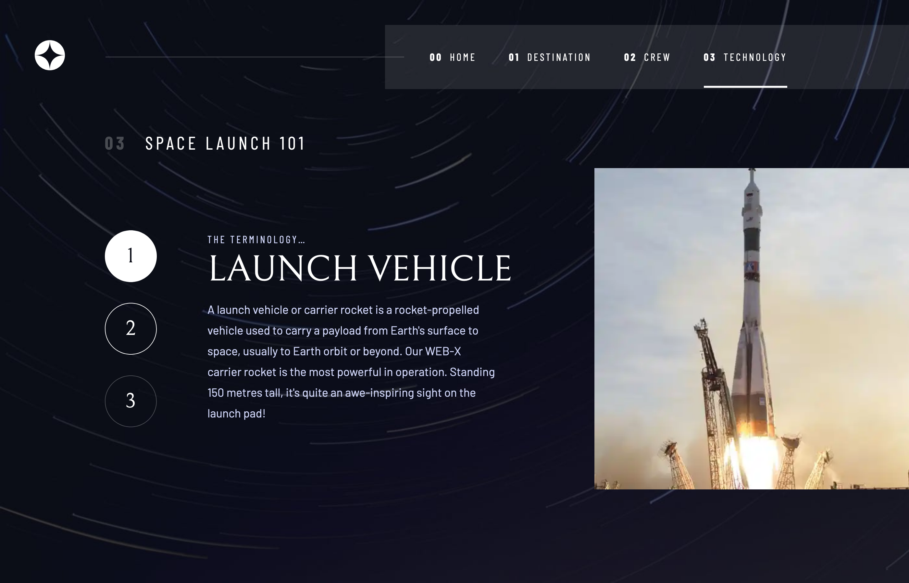

# Frontend Mentor - Space tourism website solution

This is a solution to the [Space tourism website challenge on Frontend Mentor](https://www.frontendmentor.io/challenges/space-tourism-multipage-website-gRWj1URZ3). Frontend Mentor challenges help you improve your coding skills by building realistic projects. 

## Table of contents

- [Overview](#overview)
  - [The challenge](#the-challenge)
  - [Screenshot](#screenshot)
  - [Links](#links)
- [My process](#my-process)
  - [Built with](#built-with)
- [Author](#author)

## Overview

### The challenge

Users should be able to:

- View the optimal layout for each of the website's pages depending on their device's screen size
- See hover states for all interactive elements on the page
- View each page and be able to toggle between the tabs to see new information

### Screenshot

### Links

- Live Site URL: [Add live site URL here](https://space-tourism-web-giulialiotti.vercel.app/)

## My process

### Built with

- [Gatsby JS](https://www.gatsbyjs.com/) - React framework
- [Theme UI](https://theme-ui.com/) - Library for creating themeable user interfaces
- [Framer Motion](https://www.framer.com/motion/) - Motion library for React

## Author

- Github - [giulialiotti](https://github.com/giulialiotti)
- LinkedIn - [Giuliana Aliotti](https://www.linkedin.com/in/giuliana-aliotti-1921bb203/)
